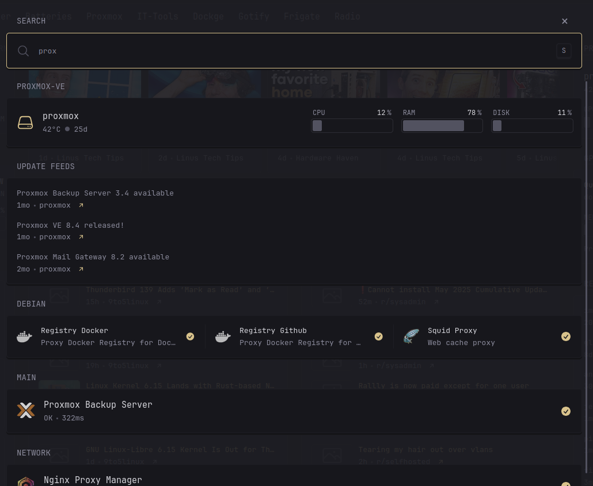
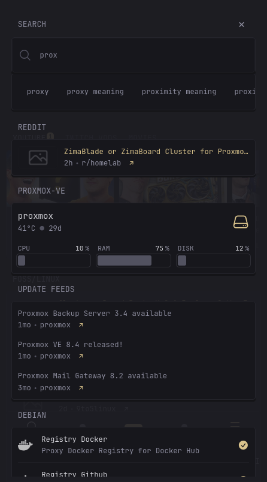
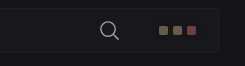
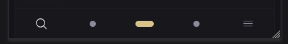

[<= Micro-script list](../#micro-scripts)






# Overview
This adds a way to search through your widgets—similar to Quick Launch from [Homepage](https://gethomepage.dev/configs/settings/#quick-launch). There's an open [feature request](https://github.com/glanceapp/glance/issues/133#issuecomment-2159504258) for native support, but until then, this provides a workaround.

# Limitations
- Only the Docker, Monitor, and recurring HTML structure widgets like RSS are supported. 
- If you have a `custom-api`, `extension`, or `html` widget that uses the same HTML structure, you can simply add the property `css-class: glimpsable`.
- Popovers and similar elements do not work on searched widgets. The scripts have already been initialized and cannot be reinitialized unless you manually copy and reinitialize them with each search—which adds overhead.

# File explanations
_Read the main [README](../#micro-scripts) to learn how this should be `$include`d._
- `pre-glance.js` - must be added after the DOM is loaded
- `post-glance.js` - must be added after Glance is loaded
- `spawn.js` - a shared function that launches Glimpse
- `glimpse.css` - the...uhm... css, you have to load this with either the [default method](https://github.com/glanceapp/glance/blob/main/docs/configuration.md#custom-css-file) or if you already use the default then you can import it inside:
    ```css
    @import url('glimpse.css');
    ```

# Configurations
## Setting up
This requires Glance’s search layout. Set up your search widget first (if you haven’t already) by following their configuration doc: https://github.com/glanceapp/glance/blob/v0.8.3/docs/configuration.md#search-widget

### Copying the search widget
Once it’s set up and visible, you’ll need to copy its HTML structure.

*Instructions may vary depending on your browser*
1. Open DevTools (F12, [more info](https://developer.chrome.com/docs/devtools/open))
2. In the Elements or Inspector tab, select Glance’s Search element (Ctrl+Shift+C)
3. Ensure the element has a class containing `widget-type-search`, right-click it, then choose `Copy` > `Copy Outer HTML`
4. In `pre-glance.js`, paste the copied HTML into the `glanceSearch` variable
5. Disable Glance’s built-in search to avoid conflicts with the keybinding used by this script

### Search Suggestion
Due to [some limitations](https://developer.mozilla.org/en-US/docs/Web/HTTP/Guides/CORS) and the fact this is a client script, you’ll need to proxy external search suggestions (e.g., from DuckDuckGo or Google) using a service like your own Node.js server.

For `searchEngineEndpoint`, copy the value from the data `data-default-search-url` attribute of the search widget you copied, and assign it to this variable.

For `searchSuggestEndpoint`, use the URL of your proxy endpoint. If you're using something like [Whoogle-Search](https://github.com/benbusby/whoogle-search), the endpoint would be `/autocomplete?q=`, so you would set it like this: `https://whoogle.mydomain.com/autocomplete?q=`.

## Other page search
You can enable search on other pages by adding their slugs to the `otherPagesSlug` array variable. **Note: this may cause slowdowns or may not work at all due to how it is implemented.**

Slugs are used instead of titles or page names since they can be [custom-defined](https://github.com/glanceapp/glance/blob/v0.8.3/docs/configuration.md#slug).

## Custom layout
You can use the class `glimpsable-custom` for custom HTML layouts, along with attributes `glimpse-list` and `glimpse-item`.
```HTML
<ul glimpse-list>
    <li glimpse-item>1</li>
    <li glimpse-item>2</li>
</ul>
```

*But this may not work that accurately as of now.*