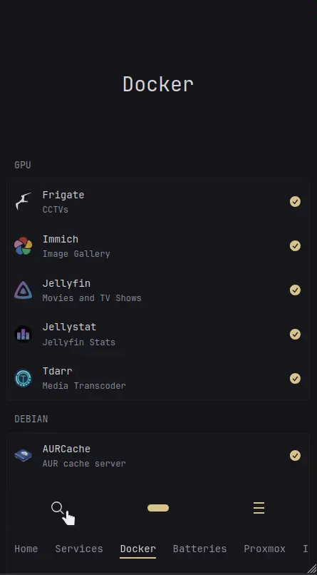

[⇐ Micro-script list](../#micro-scripts)

### Desktop


### Mobile


# Overview
This adds a way to search through your widgets—similar to Quick Launch from [Homepage](https://gethomepage.dev/configs/settings/#quick-launch). There's an open [feature request](https://github.com/glanceapp/glance/issues/133#issuecomment-2159504258) for native support, but until then, this provides a workaround.

# Limitations
- Only the Docker, Monitor, and recurring HTML structure widgets like RSS are supported. 
- If you have a `custom-api`, `extension`, or `html` widget that uses the same HTML structure, you can simply add the property `css-class: glimpsable`.
- Popovers and similar elements do not work on searched widgets. The scripts have already been initialized and cannot be reinitialized unless you manually copy and reinitialize them with each search—which adds overhead.

# File explanations
_Read the main [README](../#micro-scripts) to learn how this should be `$include`d._
- `pre-glance.js` - must be added after the DOM is loaded
- `post-glance.js` - must be added after Glance is loaded
- `spawn.js` - a shared function that launches Glimpse
- `glimpse.css` - the...uhm... css, you have to load this with either the [default method](https://github.com/glanceapp/glance/blob/main/docs/configuration.md#custom-css-file) or if you already use the default then you can import it inside:
    ```css
    @import url('glimpse.css');
    ```

# Configurations
## Setting up
Check the [Glance Search Properties](https://github.com/glanceapp/glance/blob/v0.8.4/docs/configuration.md#properties-10), it should be almost similar in terms of configuration. Here's a quick configuration to get you started:
```javascript
  const glanceSearch = { 
    searchUrl: 'https://duckduckgo.com/?q={QUERY}',
    newTab: true,
    autofocus: false,
    target: '_blank',
    placeholder: 'Type here to search…',
    bangs: [
      { title: 'Google', shortcut: '!g', url: 'https://www.google.com/search?q={QUERY}' },
      { title: 'Bing', shortcut: '!b', url: 'https://www.bing.com/search?q={QUERY}' },
    ]
  };
```

## Search Suggestion
Due to [some limitations](https://developer.mozilla.org/en-US/docs/Web/HTTP/Guides/CORS) and the fact this is a client script, you’ll need to proxy external search suggestions (e.g., from DuckDuckGo or Google) using a service like your own Node.js server.

For `searchSuggestEndpoint`, use the URL of your proxy endpoint. If you're using something like [Whoogle-Search](https://github.com/benbusby/whoogle-search), the endpoint would be `/autocomplete?q=`, so you would set it like this: `https://your-whoogle-domain.com/autocomplete?q=`.

## Other page search
By default, Glimpse searches only the currently loaded page. To include other pages, set the `pagesSlug` array variable with your primary page's slug and any additional pages.

Slugs are used instead of titles or page names since they can be [custom-defined](https://github.com/glanceapp/glance/blob/v0.8.4/docs/configuration.md#slug).

> [!NOTE]
>
> This may lead to performance issues or unreliable behavior due to how it’s implemented.
>
> The implementation uses `iframe`s to load additional pages. If widgets on those pages exceed the default timeout, their associated resources may not be released in a timely manner, leading to accumulated overhead—the more pages you include, the more it adds up.
>
> The current page where Glimpse was launched will still be prioritized and shown first.


## Custom layout
> [!CAUTION]
>
> Still Experimental, there will be accuracy issues for complex layouts.
> And this is subject to change a lot...

You can use the class `glimpsable-custom-list` for custom HTML layouts, along with attributes `glimpse-list` and `glimpse-item`.
```yml
css-class: glimpsable-custom-list
template: |
    <ul glimpse-list>
        <li glimpse-item>1</li>
        <li glimpse-item>2</li>
    </ul>
```
or with `glimpsable-custom` with attribute `glimpse`.
```yml
css-class: glimpsable-custom
template: |
    <div glimpse>
        Some searchable string
    </div>
```

## Exclusions
Add this property to your widget if you don't want a specific widget to be searched.
```yml
css-class: glimpsable-hidden
```

## Other user definable variables
| Variables           | Default | Description |
|---------------------|---------|---------------------------|
| `cleanupOtherPages` | true | Whether to clean the iframes or not. Can lead to high usage if set to `false` but could otherwise speed up your widget queries |
| `glimpseKey` | '' | The shortcut key to call Glimpse, set to empty `''` by default to disable. *Setting this to `'s'` will override Glance's default search key focus* |
| `waitForGlance` | true | Setting this to `false` will make the search and search-bangs functionality of Glance not work as those are loaded after Glance is ready, Glimpse functionality will remain working. This just limits when the `glimpseKey` can be triggered |