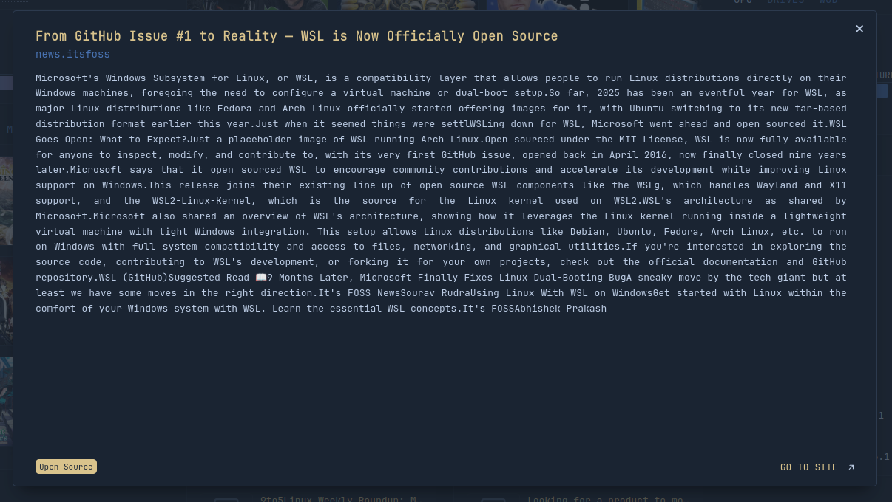
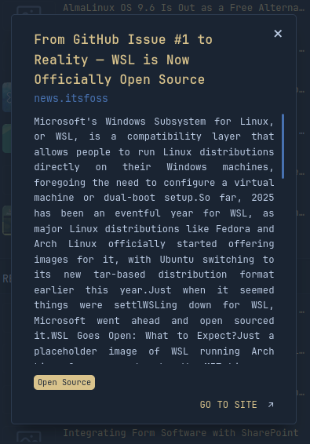

[<= Micro-script list](../#micro-scripts)

No native modal in Glance at the moment though there was a request for it: https://github.com/glanceapp/glance/discussions/190

Until then, this will have to do.




# How to
```html
<div data-content-type="modal">
  <!-- <div modal-header>
    Header, can be omitted
  </div> -->
  <div modal-body>
    Body
  </div>
  <!-- <div modal-footer>
    Footer, can be omitted
  </div> -->
  Click me! <!-- Single html tag or plain text as the button -->
</div>
```
## Attributes
* `data-content-type="modal"`: will be used as a modal container
* `dismiss-on-outside-click`: will allow the modal to be closed when clicked outside
* `modal-no-background`: will remove the background of the modal
* `width`: small, medium, wide, full
* `height`: short, medium, tall, full