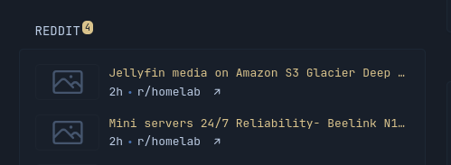
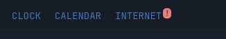

[<= Micro-script list](../)

> [!Note]
>
> Still need to check if this is overriding something as this adds ::after on the tab, right now I haven't been able to find it but I remember one time when a widget has a network issue, it would add a red dot beside it.





This is mainly for `custom-api` and/or "probably" `extension` too. If you need this on other widgets then you can convert those to `custom-api` or request this feature entirely as this can not interact with Glance's queries.

# How to
1. Add this the template config
    ```html
    <div class="tab-notification display-none" tab-notification-count="{{ $notificationCount }}" tab-title="{{ $notificationTitle }}"></div>
    ```
    make sure it's outside any loop and preferably inside your collapsible container
2. `tab-notification-count` attribute can hold a text like "!" paired with `tab-notification-error` attribute to make the background-color negative.
3. `{{ $notificationCount }}` as an example can be inside a loop to count the number of data
    ```go
    {{ $notificationCount := 0 }}
    {{ range $index, $item := $items }}
        {{ $notificationCount := add $notificationCount 1 }}
    {{ end }}
    ```
    or you can add a condition to only count based on date or anything applicable.